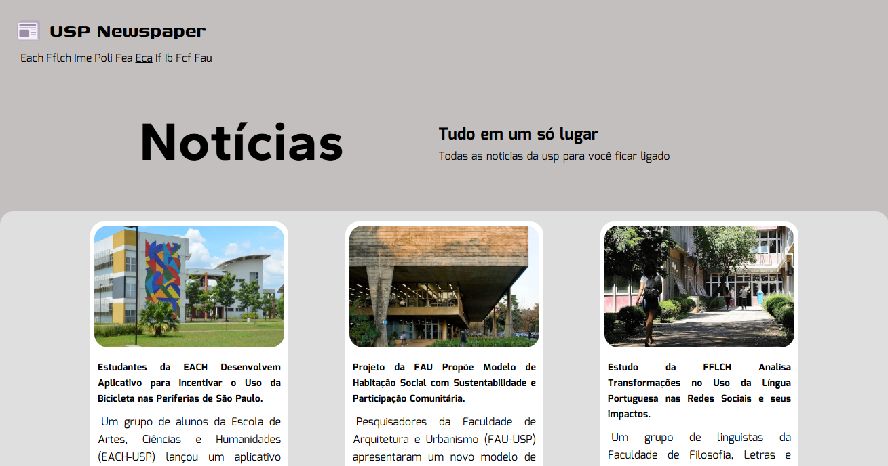
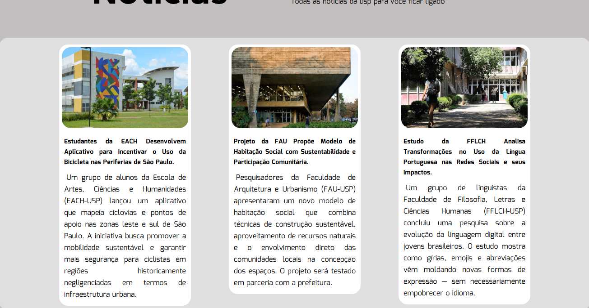
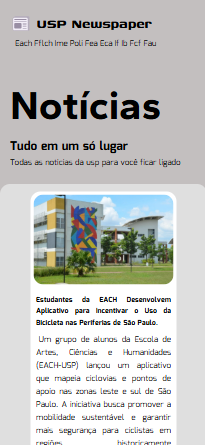
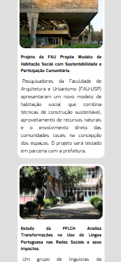
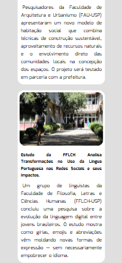

# Site Página de Notícias
O seguinte projeto é uma páginas com notícias imaginárias, as manchetes e o corpo do texto foram criados pelo chatgpt, a fim de treinar e praticar os meus conhecimentos em HTML5 e CSS3.

Para acessar o site, acesso o link abaixo:

    https://higormauricio.github.io/Desafio-HTML-CSS/Desafio%203/index.html

## Imagens do site

### Site em tela grande:

### Site em tela pequena:

